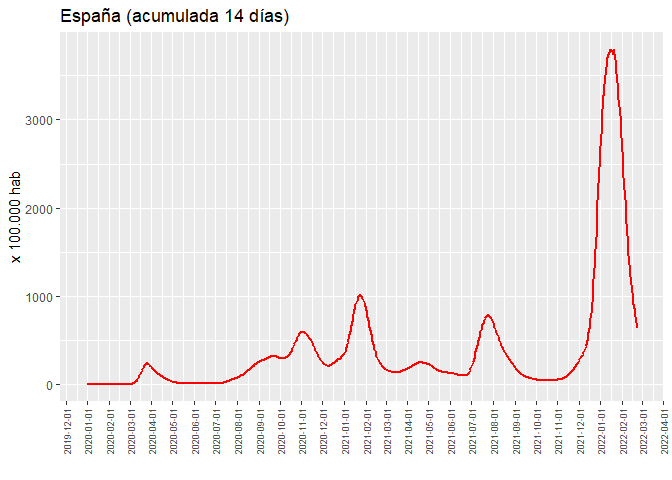
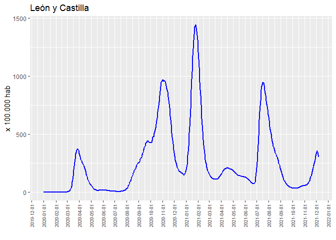
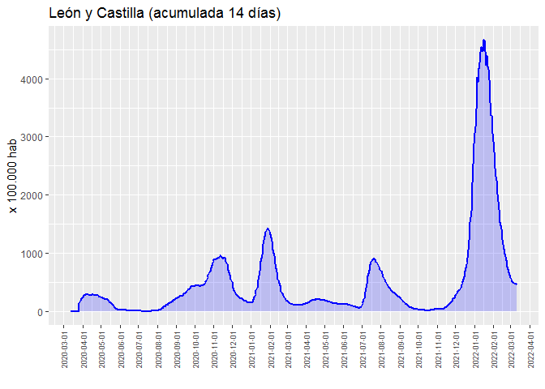

Covid-19: Incidencia acumulada
================
JMSS \[Usal - CIC\]
(updated: 15 dic. 2021)

### Incidencia acumulada del Covid19 a 14 días por cada 100.000 habitantes

Datos desde *01/01/2020* extraidos de: [Datadista
GitHub](https://github.com/datadista/datasets/tree/master/COVID%2019)

<!-- --><!-- --><!-- -->
