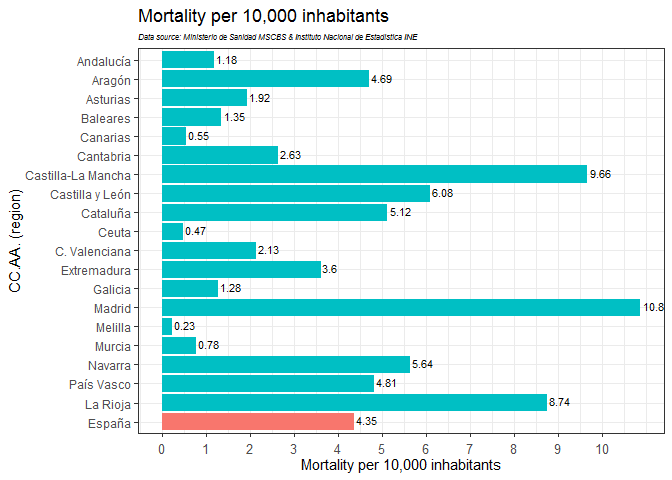
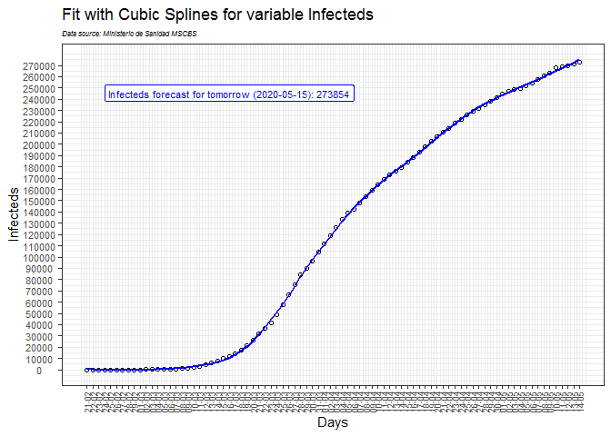
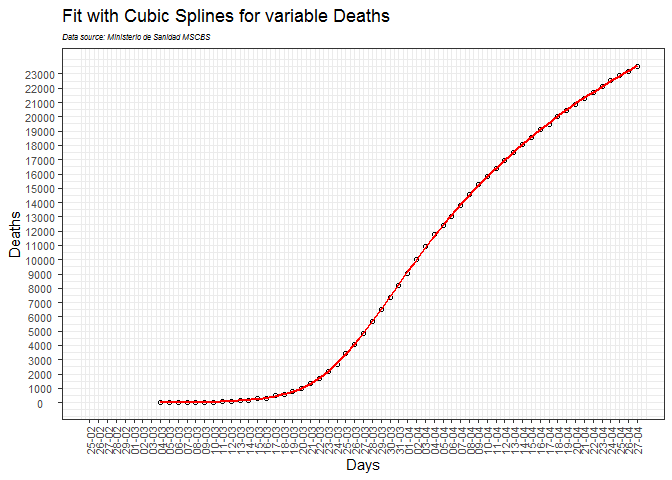
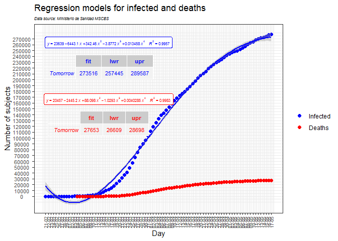

Covid-19: The case of Spain
================
by JMSS (Usal - CIC)

# Models for the COVID-19 pandemic in Spain

## DATA

Daily data:
[Wikipedia](https://es.wikipedia.org/wiki/Pandemia_de_enfermedad_por_coronavirus_de_2020_en_España)
(and Ministerio de Sanidad
[MSCBS](https://www.mscbs.gob.es/profesionales/saludPublica/ccayes/alertasActual/nCov-China/situacionActual.htm))

<!-- --><!-- --><!-- --><!-- -->

Since we do not know the true data of infected people, two important
variables to take into account are the daily increase in infected and
death people.

<!-- --><!-- -->

The following graph shows the differences between CC.AA. (regions) in
mortality per 10,000 inhabitants.

<!-- -->

-----

## CUBIC SPLINES

Since April 5, I propose this new model to predict the number of deaths,
since the SIR and regression models seem to make bigger mistakes in
their predictions.

It is based on interpolation with cubic splines. See
[Wikipedia](https://en.wikipedia.org/wiki/Spline_interpolation)

<!-- -->

<!-- -->

##### Infecteds forecast for tomorrow (2020-04-08): 145988

##### Deaths forecast for tomorrow (2020-04-08): 14541

Previous predictions:

    Infecteds forecast:

    06-04 -> predicted = 136782; observed = 135032; error =  1.3%
    07-04 -> predicted = 139305; observed = 140510; error = -0.9%

    Deaths forecast:

    06-04 -> predicted = 13092; observed = 13055; error =  0.3%
    07-04 -> predicted = 13692; observed = 13798; error = -0.8%

-----

## REGRESSION MODEL

Here I use a polynomial regression model to predict number of infecteds
and deaths. See
[Wikipedia.](https://en.wikipedia.org/wiki/Regression_analysis).

I started using a cubic model but as time went on the predictions got
worse. It is now a degree 4 polynomial (since April 7).

The goodness of fit of this model is very good since the coefficient
R2 is very close to 1. At the moment a cubic fit works well,
although when it reaches the maximum it is likely that the precision of
the model will decrease.

<!-- -->

##### Infected forecast for tomorrow (2020-04-08): 152317, with 95% prediction interval: (145810 , 158824)

##### Deaths forecast for tomorrow (2020-04-08): 15470, with 95% prediction interval: (14702 , 16237)

Previous predictions:

    Infected forecast:

    24-03 -> predicted =  38574; observed =  39673; error = -2.8%
    25-03 -> predicted =  44008; observed =  47610; error = -8.2%
    26-03 -> predicted =  51614; observed =  56188; error = -8.9%
    27-03 -> predicted =  60476; observed =  64059; error = -5.9%
    28-03 -> predicted =  69832; observed =  72248; error = -3.5%
    29-03 -> predicted =  79588; observed =  78797; error =  1.0%
    30-03 -> predicted =  88856; observed =  85195; error =  4.1%
    31-03 -> predicted =  97620; observed =  94417; error =  3.3%
    01-04 -> predicted = 107073; observed = 102136; error =  4.6%
    02-04 -> predicted = 116393; observed = 110238; error =  5.3%
    03-04 -> predicted = 125701; observed = 117710; error =  6.4%
    04-04 -> predicted = 134713; observed = 124736; error =  7.4%
    05-04 -> predicted = 143291; observed = 130759; error =  8.7%
    06-04 -> predicted = 151139; observed = 135032; error = 10.7%
    07-04 -> predicted = 157785; observed = 140510; error = 10.9%

    Deaths forecast:

    24-03 -> predicted =  2836; observed =  2696; error =  4.9%
    25-03 -> predicted =  3355; observed =  3434; error = -2.4%
    26-03 -> predicted =  3930; observed =  4089; error = -4.0%
    27-03 -> predicted =  4563; observed =  4858; error = -6.5%
    28-03 -> predicted =  5256; observed =  5690; error = -8.3%
    29-03 -> predicted =  6199; observed =  6528; error = -5.3%
    30-03 -> predicted =  7196; observed =  7340; error = -2.0%
    31-03 -> predicted =  8212; observed =  8189; error =  0.3%
    01-04 -> predicted =  9248; observed =  9053; error =  2.1%
    02-04 -> predicted = 10296; observed = 10003; error =  2.8%
    03-04 -> predicted = 11379; observed = 10935; error =  3.9%
    04-04 -> predicted = 12475; observed = 11744; error =  5.9%
    05-04 -> predicted = 13529; observed = 12418; error =  8.2%
    06-04 -> predicted = 14496; observed = 13055; error =  9.9%
    07-04 -> predicted = 15379; observed = 13798; error = 10.3%

-----

## SIR MODEL

I will use the same model used in this post: [Epidemiology: How
contagious is Novel Coronavirus
(2019-nCoV)](http://blog.ephorie.de/epidemiology-how-contagious-is-novel-coronavirus-2019-ncov)?.
You can find all the details there and in the comments. It is a [SIR
model](https://es.wikipedia.org/wiki/Modelo_SIR).

The results should not be taken seriously since the absence of real data
makes the model inconsistent. This entry was created for informational
purposes on SIR models. I will try to update it daily. More reliable
information can be found at [IMM-UPV](https://www.imm.upv.es/covid-19/)

Estimates with the SIR model:

<!-- -->

According to this model, the rate of infection is 1.37, the height of
the pandemic will be reached by 21/04/2020.

About 1854017 people would be infected by then, which translates to
about 889928 hospitalized cases, about 111241 cases in need of intensive
care (UCI) and up to 148321 deaths.

#### Infected forecast for tomorrow: 206927 (2020-04-08)

Previous predictions:

    21-03 -> predicted =  24896; observed =  25374; error = -1.9%
    22-03 -> predicted =  30117; observed =  28768; error =  4.5%
    23-03 -> predicted =  35272; observed =  33089; error =  6.2%
    24-03 -> predicted =  57913; observed =  39673; error = 31.5%
    25-03 -> predicted =  48440; observed =  47610; error =  1.7%
    26-03 -> predicted =  57420; observed =  56188; error =  2.1%
    27-03 -> predicted =  67868; observed =  64059; error =  5.6%
    28-03 -> predicted =  78955; observed =  72248; error =  8.5%
    29-03 -> predicted =  90661; observed =  78797; error = 13.1%
    30-03 -> predicted = 102000; observed =  85195; error = 16.5%
    31-03 -> predicted = 113106; observed =  94417; error = 16.5%
    01-04 -> predicted = 125311; observed = 102136; error = 18.5%
    02-04 -> predicted = 137373; observed = 110238; error = 19.8%
    03-04 -> predicted = 150165; observed = 117710; error = 21.6%
    04-04 -> predicted = 162414; observed = 124736; error = 23.2%
    05-04 -> predicted = 174860; observed = 130759; error = 25.2%
    06-04 -> predicted = 186188; observed = 135032; error = 27.5%
    07-04 -> predicted = 196945; observed = 140510; error = 28.7%

-----

\#StayAtHome \#QuedateEnCasa

-----
