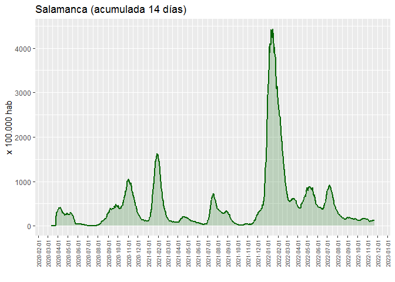
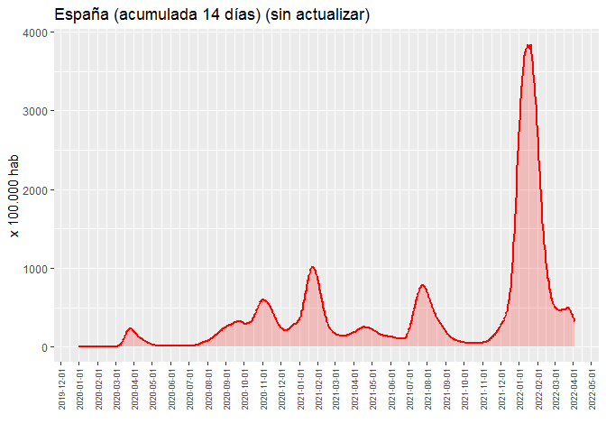
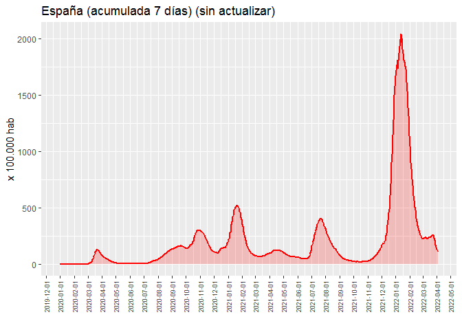

Covid-19: Incidencia acumulada
================
JMSS \[Usal - CIC\]
(updated: 28 ene 2022)

### Incidencia acumulada del Covid19 por cada 100.000 habitantes

Datos extraídos de [CNE-covid
ISCIII](https://cnecovid.isciii.es/covid19) y de [Junta de Castilla y
León - Datos
abiertos](https://analisis.datosabiertos.jcyl.es/pages/home/)

<!-- --><!-- --><!-- --><!-- -->
