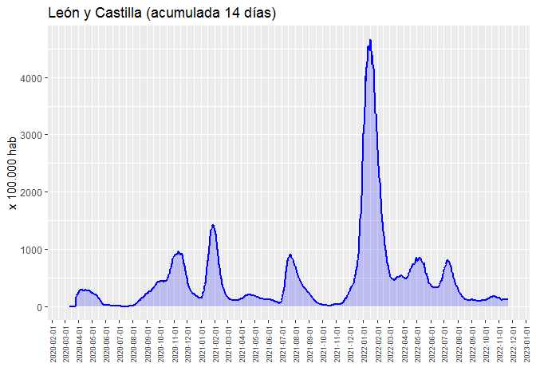

Covid-19: Incidencia acumulada
================
JMSS \[Usal - CIC\]
(updated: 28 dic 2021)

### Incidencia acumulada del Covid19 a 14 días por cada 100.000 habitantes

Datos desde *01/01/2020* extraidos de: [CNE-covid
ISCIII](https://cnecovid.isciii.es/covid19) y de [Junta de Castilla y
León - Datos
abiertos](https://analisis.datosabiertos.jcyl.es/pages/home/)

<!-- --><!-- --><!-- -->
