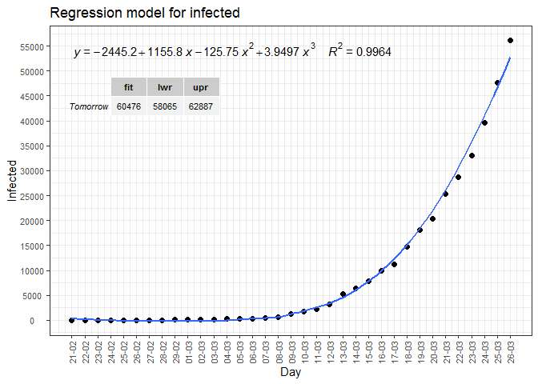

Covid-19: The case of Spain
================
JMSS (Usal - CIC)

# Models for the coronavirus crisis

## SIR MODEL

I will use the same model used in this post: [Epidemiology: How
contagious is Novel Coronavirus
(2019-nCoV)](http://blog.ephorie.de/epidemiology-how-contagious-is-novel-coronavirus-2019-ncov)?.
You can find all the details there and in the comments. It’s a [SIR
model](https://es.wikipedia.org/wiki/Modelo_SIR).

The results should not be taken seriously since the absence of real data
makes the model inconsistent. This entry was created for informational
purposes on SIR models. I will try to update it daily. More reliable
information can be found at [IMM-UPV](https://www.imm.upv.es/covid-19/)

Daily data:
[Wikipedia](https://es.wikipedia.org/wiki/Pandemia_de_enfermedad_por_coronavirus_de_2020_en_España)

<!-- --><!-- -->

Since we do not know the true data of infected people, an important
variable to take into account is the daily increase in infected people.
In the following graph we observe this increase seems to have a downward
trend in recent days (despite variability increases)

<!-- -->

Estimates with the SIR model:

<!-- --><!-- -->

According to this model, the rate of infection is 2.02, the height of
the pandemic will be reached by 13/04/2020.

About 7370544 people would be infected by then, which translates to
about 1363551 severe cases, about 368527 cases in need of intensive care
and up to 51594 deaths.

##### Infected forecast for tomorrow: 48440 (2020-03-25)

*We observe that each day the prediction is worse, it has more error:*

21mar20 -\> predicted = 24896; observed = 25374; error = 1.9%

22mar20 -\> predicted = 30117; observed = 28768; error = 4.7%

23mar20 -\> predicted = 35272; observed = 33089; error = 6.6%

24mar20 -\> predicted = 57913; observed = 39673; error = 46.0%

## REGRESSION MODEL

How the SIR model seems to predict worse, I use a cubic polynomial
regression model. See
[Wikipedia.](https://en.wikipedia.org/wiki/Regression_analysis)

The fit of the model is very good since the coefficient \(R^2\) is very
close to 1.

<!-- -->

24mar20 -\> Predicted = 38574; Observed = 39673; error = 2.8%

##### Infected forecast for tomorrow (2020-03-25): 44008, with 95% prediction interval: (42788 , 45229)

-----

\#StayAtHome \#QuedateEnCasa
